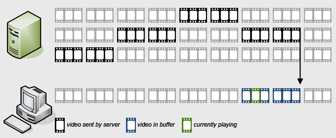

## 1. Giới thiệu về HTTP Live Streaming (HLS)

HTTP Live Streaming (hay còn được biết đến là HLS) là một cách truyền media dựa trên giao thức HTTP được Apple phát triển. Nó hỗ trợ các luồng trực tuyến, có khả năng thay đổi chất lượng phù hợp với thiết bị và băng thông mạng đang sử dụng. Cụ thể, giao thức làm việc như sau

- Một tệp tin hay một luồng live sẽ được chia thành các file nhỏ
- Các file nhỏ bên trên sẽ được lưu trữ trong một máy chủ web và lắng nghe các request từ một trình player.
- Khi phát, player sẽ phát liên tiếp các file nhỏ một cách liền mạch mà không bị ngắt quãng

Nếu stream được chia thành nhiều chất lượng khác nhau (480p, 720p), thì player sẽ tự động lựa chọn chất lượng video tốt nhất để phát dựa theo tình trạng băng thông mạng. Thuật ngữ này là Adaptive Streaming (Thích nghi với điều kiện).



Tổng quan: https://docs.google.com/document/d/1SQU50h-ybMNwexiOL3QWOSg7t3PxAPg1lNbfTzOVe9k/edit?usp=sharing

Powered by <a href="http://meditech.vn">MediTech,. JSC</a> - (C) HoangDH

## 2. Hướng dẫn tạo server video streaming

##### Thông tin về server cài đặt

```

OS: CentOS 6.7
NIC: eth0 - 192.168.100.192
Internet: Có (Bắt buộc)

```

### Cài đặt ffmpeg để chuyển đổi video thường sang dạng Streaming (ts)

Cài đặt các trình biên dịch cần thiết.
**Lưu ý:** Tất cả các lệnh dưới đây phải chạy trên quyền cao nhất của hệ thống (root).

```
yum update
yum install -y autoconf automake cmake freetype-devel gcc gcc-c++ git libtool make mercurial nasm pkgconfig zlib-devel
```

#### 1. Biên dịch yasm từ source

```
mkdir ~/ffmpeg_sources
cd ~/ffmpeg_sources
git clone --depth 1 git://github.com/yasm/yasm.git
cd yasm
autoreconf -fiv
./configure --prefix="$HOME/ffmpeg_build" --bindir="$HOME/bin"
make
make install
make distclean
```

#### 2. Biên dịch gói mã hóa video dạng x264 và x265

```
cd ~/ffmpeg_sources
git clone --depth 1 git://git.videolan.org/x264
cd x264
PKG_CONFIG_PATH="$HOME/ffmpeg_build/lib/pkgconfig" ./configure --prefix="$HOME/ffmpeg_build" --bindir="$HOME/bin" --enable-static
make
make install
make distclean
cd ~/ffmpeg_sources
hg clone https://bitbucket.org/multicoreware/x265
cmake -G "Unix Makefiles" -DCMAKE_INSTALL_PREFIX="$HOME/ffmpeg_build" -DENABLE_SHARED:bool=off source

```

#### 3. Biên dịch gói mã hóa âm thanh chuẩn ACC

```
cd ~/ffmpeg_sources
git clone --depth 1 git://git.code.sf.net/p/opencore-amr/fdk-aac
cd fdk-aac
autoreconf -fiv
./configure --prefix="$HOME/ffmpeg_build" --disable-shared
make
make install
make distclean
```

#### 4. Biên dịch gói mã hóa âm thanh LAME

```
cd ~/ffmpeg_sources
curl -L -O http://downloads.sourceforge.net/project/lame/lame/3.99/lame-3.99.5.tar.gz
tar xzvf lame-3.99.5.tar.gz
cd lame-3.99.5
./configure --prefix="$HOME/ffmpeg_build" --bindir="$HOME/bin" --disable-shared --enable-nasm
make
make install
make distclean
```

#### 5. Biên dịch code OPUS

```
cd ~/ffmpeg_sources
git clone http://git.opus-codec.org/opus.git
cd opus
autoreconf -fiv
./configure --prefix="$HOME/ffmpeg_build" --disable-shared
make
make install
make distclean
```

#### 6. Biên dịch thư viện âm thanh OGG

```
cd ~/ffmpeg_sources
curl -O http://downloads.xiph.org/releases/ogg/libogg-1.3.2.tar.gz
tar xzvf libogg-1.3.2.tar.gz
cd libogg-1.3.2
./configure --prefix="$HOME/ffmpeg_build" --disable-shared
make
make install
make distclean
```

#### 7. Biên dịch thư viện mã hóa âm thanh Vorbis

```
cd ~/ffmpeg_sources
curl -O http://downloads.xiph.org/releases/vorbis/libvorbis-1.3.4.tar.gz
tar xzvf libvorbis-1.3.4.tar.gz
cd libvorbis-1.3.4
LDFLAGS="-L$HOME/ffmeg_build/lib" CPPFLAGS="-I$HOME/ffmpeg_build/include" ./configure --prefix="$HOME/ffmpeg_build" --with-ogg="$HOME/ffmpeg_build" --disable-shared
make
make install
make distclean
```

#### 8. Biên dịch thư viện libvpx của WebM

```
cd ~/ffmpeg_sources
git clone --depth 1 https://chromium.googlesource.com/webm/libvpx.git
cd libvpx
./configure --prefix="$HOME/ffmpeg_build" --disable-examples
make
make install
make clean
```

#### 9. Biên dịch ffmpeg

```
cd ~/ffmpeg_sources
git clone --depth 1 https://git.videolan.org/git/ffmpeg.git
cd ffmpeg
PKG_CONFIG_PATH="$HOME/ffmpeg_build/lib/pkgconfig" ./configure --prefix="$HOME/ffmpeg_build" --extra-cflags="-I$HOME/ffmpeg_build/include" --extra-ldflags="-L$HOME/ffmpeg_build/lib" --bindir="$HOME/bin" --pkg-config-flags="--static" --enable-gpl --enable-nonfree --enable-libfdk-aac --enable-libfreetype --enable-libmp3lame --enable-libopus --enable-libvorbis --enable-libvpx --enable-libx264
make
make install
make distclean
```

#### Sau khi biên dịch đủ 9 gói, chúng ta gõ lệnh `ffmpeg` để kiểm tra


### Chuyển đổi video thường sang dạng Streaming (ts)

```
ffmpeg -y -i input.mp4 -r 25 -g 25 -c:a libfdk_aac -b:a 128k -c:v libx264 -preset veryfast -b:v 1600k -maxrate 1600k -bufsize 800k -s 640x360 -c:a libfdk_aac -vbsf h264_mp4toannexb -flags -global_header -f ssegment -segment_list playlist.m3u8 -segment_list_flags +live-cache -segment_time 5 output-%04d.ts
```

- `input.mp4`: Video có định dạng thông thường có thể như AVI, MPG, MKV,...
- `playlist.m3u8`: Playlist chứa thông tin các file stream
- `output-%04d`: File stream có dạng output-0001.ts, output-000n.ts

### Cài đặt Web Server để players chạy stream

Chúng ta cài đặt NGINX

```
yum install -y nginx
service nginx start
chkconfig nginx on
```

Tắt SELinux và mở port 80 trên iptables

```
sed s/"SELINUX=enforcing"/"SELINUX=disabled"/g /etc/sysconfig/selinux
iptables -A INPUT -p tcp --dport 80 -j ACCEPT
service iptables save
service iptables restart
```

Copy các file stream, playlist vào một thư thục và chuyển chúng tới thư mục public html của bạn.

Mặc định, thư mục public của nginx ở CentOS

```
/usr/share/nginx/html
```


Địa chỉ stream của tôi: http://192.168.100.192/bai-hat-abc/playlist.m3u8

Tham khảo xây dựng 1 máy chủ Live streaming tại [đây](https://github.com/hoangdh/ghichep-StreamingVideo/blob/master/Setup-NGINX-RTMP.md).

Cảm ơn bạn đã đọc tới dòng này!
